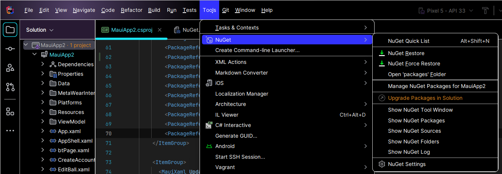

+++
title = "Mobile Application"
weight = 100
description = 'How to setup your development environment for the mobile app'
+++

### Overview
Below you'll find instructions on how to setup your development environment for the mobile application.  All tools and technologies needed can be found with their version numbers on the [Technologies Used](../../../technologies-used/index.html) page, along with the same download links provided there being seen throughout this guide. There are a handful of tools needed and steps to be followed, so buckle up:

### Installing The JetBrains Rider IDE
The first thing needed to setup your dev environment is your IDE.  For this, we'll use JetBrains Rider, which can be found downloaded [here](https://www.jetbrains.com/rider/download/#section=windows).  The setup for Rider can be followed using all of the defaults, so the installation is very straightforward.  However, we'll be coming back to Rider to setup our JDK locations for android development and such.

### Installing .NET MAUI and Xamarin
The next tool we'll need is .NET MAUI with Xamarin, which can be installed pretty easily using the Visual Studo Installer.  We'll cover how to install MAUI two ways: by modifying an existing installation of Visual Studio 2022, or by installing Visual Studio from scratch:

##### Installing Visual Studio 2022
If this is your first time installing Visual Studio on your machine, go ahead and run the installer found [here](https://visualstudio.microsoft.com/vs/community/).  Once the section where you select which workloads you would like to install pops up, go ahead and select the following (including the optional checkboxes under ".NET Multi-platform App UI Development"):

From here, you may continue the installation as normal and that is all that needs to be done relating to Visual Studio.

##### Modifying An Existing Installation of VS 2022
If you already have Visual Studio 2022 Community edition installed on your machine, you can simply run the Visual Studio Installer and click the "modify" button on VS 2022:

Now, scroll to the ".NET Multi-platform App UI Development" option and select it:

After selecting MAUI as seen above, navigate to the tab on the right listing the installation details.  Under the .NET Multi-platform App UI Development dropdown, open the optional dropdown and select "Xamarin":

Now, continue the installation as normal, this is all that needs to be done regarding Visual Studio.

### Cloning the MauiApp2 Project
To clone the mobile application from GitHub into Rider, head over to the repository found [here](https://github.com/YCP-Rev-Metrix/FrontEnd).  Select the green "code" button, and copy the Https link that pops up:

Open the Rider IDE and you'll be met with the welcome screen.  From here, click on "Get from VCS" button in the top right of the screen:

Now go ahead and paste the link that you copied into the URL field and select the path in which you would like to save the project as seen here:

Select the Clone button in the bottom right of the screen, and Rider will do the rest.  Now, the project has been cloned, but rest assured there will be errors because we still need to configure a few things inside of Rider, such as the OpenJDK 17 path.

### Installing Microsoft OpenJDK 17
OpenJDK 17 is required for Android development for this project.  Go ahead and download Microsoft's OpenJDK 17, found [here](https://learn.microsoft.com/en-us/java/openjdk/download#openjdk-17). After running the installer, select the default installation paths listed during the setup, and continue as normal.  From here, we'll open up the JetBrains Rider IDE that we installed earlier and set the Java SDK path under the Android settings to the path that we previously installed the OpenJDK 17 to. To do this, click the "Main Menu" button (4 horizontal lines) in the top left of the top navigation bar, select the "File" dropdown, then select "Settings":

Inside of the settings, select the "Build, Execution, Deployment" dropdown and click on "Android":

Now, click the dropdown for the "Java Development Kit Location" and select the "..../jdk-17.0.9.8-hotspot" option:

If the option is not listed, click the three dots to the right of the same dropdown and browse through the filesystem to select the path to the JDK specified during installation.

### Installing NuGet Pacakages for the API Client
As can be seen in the list of errors in Rider, there are plenty of errors regarding the classes Client, Common, and FeaturedAPI.  This is due to having not installed the NuGet packages for the API Client.  In order to do this, you'll need to add the RevMetrix GitHub as a NuGet source for the project in Rider.  However, we'll need to validate ourselves to this new source first. Head over to GitHub and [add a classic token](https://github.com/settings/tokens), set the expiration to one Year and be sure to select Read and Write permissions to Packages. (See example below).

Create the token, copy the value, and store the token in a safe place (you will not be able to re-access the token on GitHub).  Go ahead and copy the token and open the Rider IDE.

Head to the top navigation bar, select the "Main Menu" button, select the "Tools" dropwdown, select "NuGet", and select the "Manage NuGet Packages for MauiApp2":

From the new popup window for NuGet, select the sources tab and click on the path that includes your username:

Now, in the right tab of the same sources menu, click the green plus button next to the "New feed" item listed in the "Feeds" tab:

A popup window named "Editing: New feed" will appear, and the fields should be filled out as the following:

The field values should be filled out as such:
 - Name: **RevMetrix**
 - URL: **https://nuget.pkg.github.com/YCP-Rev-Metrix/index.json**
 - User: **Your GitHub Username**
 - Password: **Your Classic Token** (the token previously generated)

Go ahead and save this, then head over to the Packages tab of the NuGet window.  Enter "RevMetrix" into the search bar, and from the options available select "revmetrix.client.api":

Now, in the right side of the window, click the green plus button and click "Install" to successfully install the NuGet package:

After installation is complete, we are finished with NuGet packages because the Client package automatically installs the Common package too.

### Installing and Configuring Android 13.0 (API Level 33)
A crucial part of the mobile app development is having the correct Android SDK installed and selected. To do this, click the "Main Menu" button (4 horizontal lines) in the top left of the top navigation bar, select the "Tools" dropdown, and navigate to the "Android" option, and select the "Android SDK Manager" option:

After selecting the Android SDK Manager, go ahead and install the following list item:

Continue with the installation as normal. Once finished, no more action should be required for the Android portion of the application outside of the installation of the Android emulator (seen below).

### Installing the Android Emulator

### Troubleshooting

If you get the error: Error NETSDK1147: To build this project, the following workoads must be installed: xyz

Run: dotnet workload restore (This will most likely occur the first time you pull the repo and it installs any workloads needed)

Run: dotnet restore (This restores the dependencies and tools of the project)

If you get the error: NU1101: unable to find package RevMetrix.Client.Api No packages exist with this id in source(s) OR NU1301: Unable to load the service index for source RevMetrix.Client.Api

This means you need to (re)create a token in GitHub and follow the steps of setting up the Nuget package

Once that step is done invalidate caches and restart (File -> Invalidate Cache -> Invalidate Caches and Restart)

