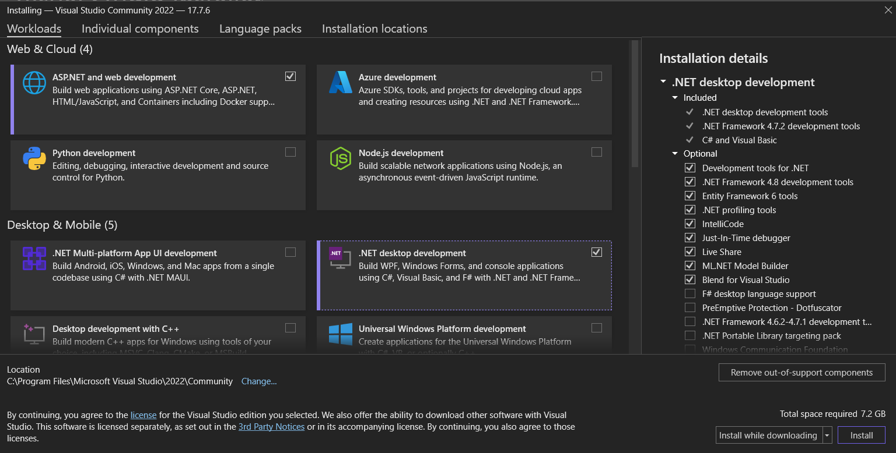
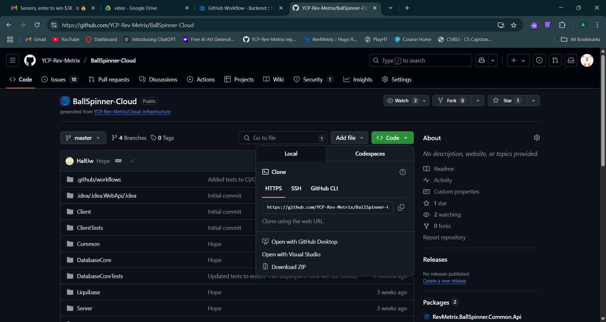
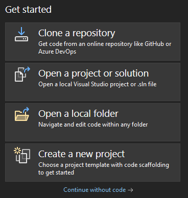
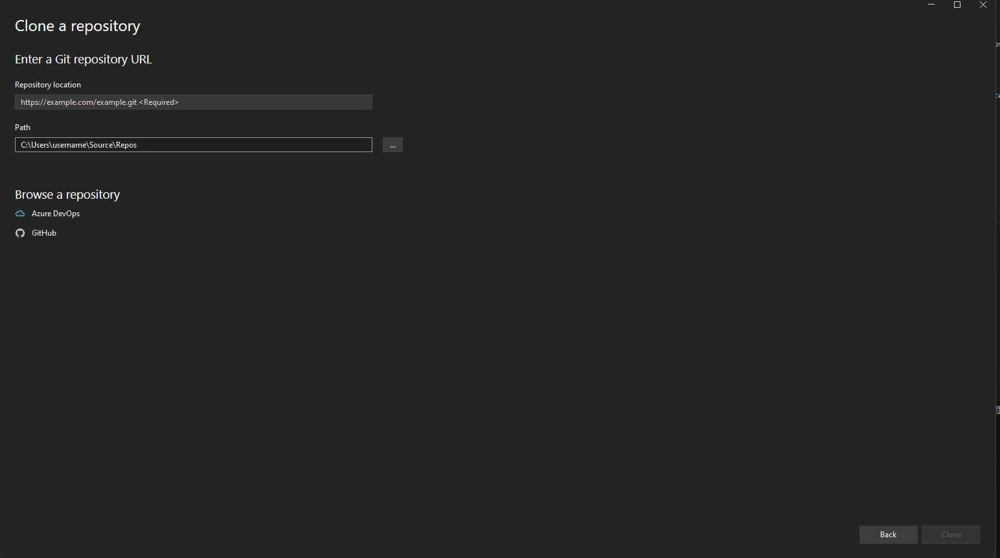
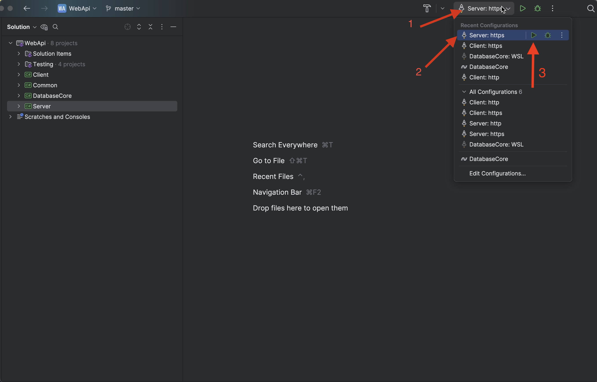
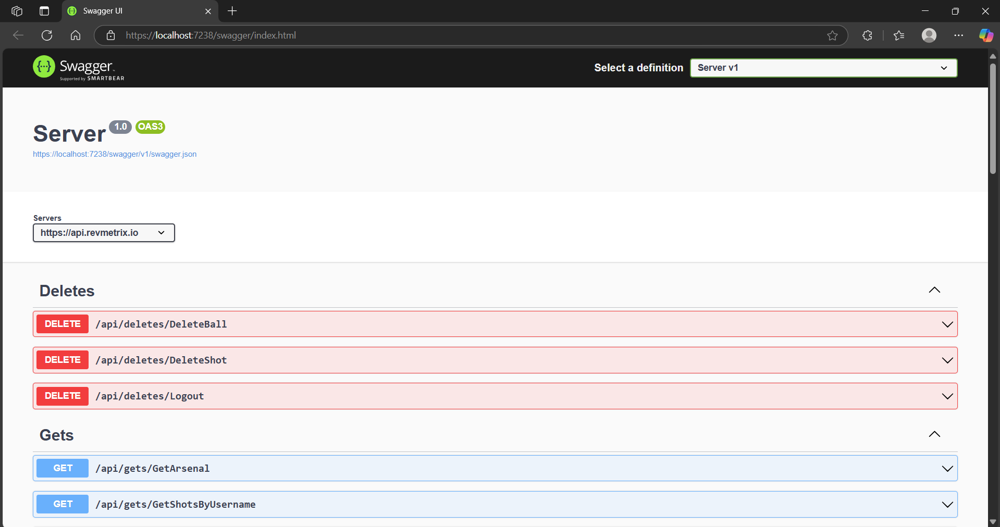

+++
title = "Cloud"
weight = 100
description = 'How to create a branch of the cloud-infrastructure repository and make edits'
+++

### Development Enviornment
The preferred development enviornment for the Cloud-Infrastructure .NET solution is [Microsoft Visual Studio 2022 Community Edition](https://visualstudio.microsoft.com/vs/).  When installing Visual Studio, make sure to install all of the options checked below:

After installing Visual Studio, you will also need to install [SQL Server Developer Edition (Free)](https://go.microsoft.com/fwlink/p/?linkid=2215158&clcid=0x409&culture=en-us&country=us).  All of the default installation settings can be followed for this.  Finally, you'll need to install [SQL Server Management Studio](https://aka.ms/ssmsfullsetup).  The default installation options for SSMS can be followed here also.

### Cloning The Repository
To clone the Cloud-Infrastructure repository, head over to the [GitHub Repository](https://github.com/YCP-Rev-Metrix/BallSpinner-Cloud.git), click the green "Code" dropdown on the repo page, then copy the https link given from the dropdown, as seen below:

After copying the repo link, open Visual Studio and click "" on the start page as seen here:

From here you will be prompted to enter the link of the repository to clone and the path at which to create the directory of the repo on your machine.  Go ahead and paste the repository link and choose where to save it, then hit the "clone" button in the bottom right as seen below:

Now that the repo has been cloned, Go ahead and click on the configuration manager next to the run button. Next, ensure that the "Server: https" configuration is selected and then hit run.

Lastly, the Swagger website will open up locally and will contain of all the API endpoints. Taaa daaa

Everything from here on is basic source control practice.  If you are unfamiliar with these practices, check out the [Git Cheat Sheet](https://education.github.com/git-cheat-sheet-education.pdf) for an introduction to them!