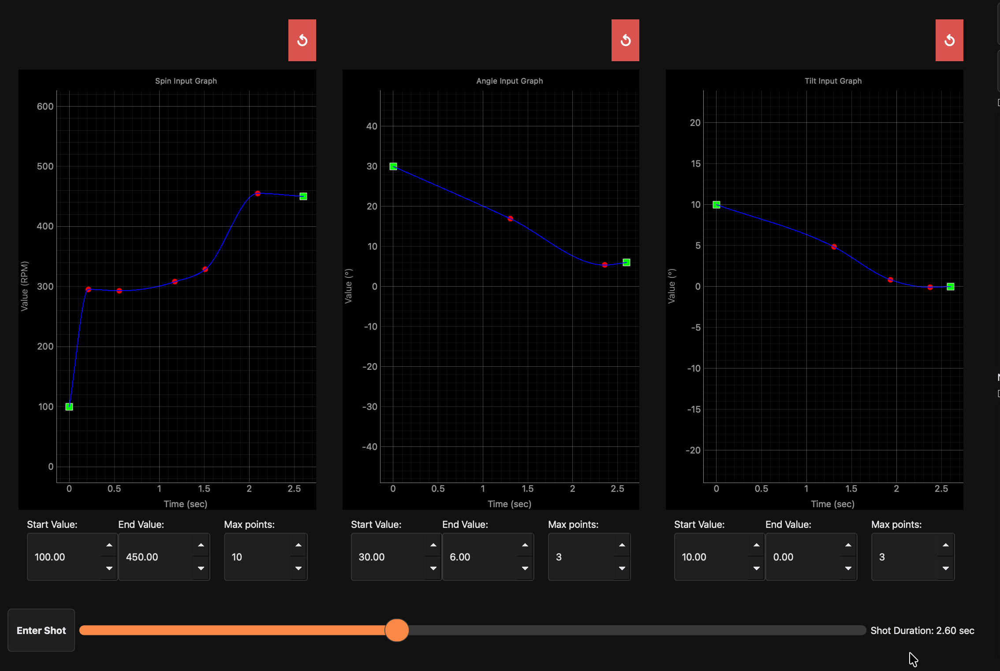

+++
title = "Sample Shot Session"
weight = 61
description = 'Example shot session flow from setup through analysis.'
+++

### Sample shot session

This sample run demonstrates a complete shot workflow from Home through Data View verification.

### Example workflow

This guide assumes first-time use and starts from [Home](../home/).

1. Open [Shot Mode](../shot_mode/).
2. In the [SmartDot Connect Widget](../smartdot_connect_widget/), press **Scan for SmartDot**.
3. After scan completes, select a SmartDot that matches a device in the arm.
   - `SI:MU:LA:TE:DD:OT` is the simulated SmartDot.
   - On desktop builds, simulated SmartDot is the available option.
4. Configure Spin:
   - Start value: `300`
   - End value: `450`
5. Configure Angle:
   - Start value: `30`
   - End value: `10`
6. Configure Tilt:
   - Start value: `15`
   - End value: `10`
7. Add Spin curve points to match this example:

8. Set shot duration slider to `2.6` seconds.
9. Press **Enter Shot**.
10. After the shot completes, press **Analyze**.
11. Run analysis actions and review output in [Analysis Mode](../analysis_mode/).
12. Open wavelet analysis and follow [Wavelet Dialog](../wavelet_dialog/) guidance.
13. Press **Save**, enter a session name, and submit.
14. Return to [Home](../home/) and open [Data View](../data_view/).
15. Set end date/time to today and one hour ahead, then press **Search**.
16. Confirm the new shot appears in Data View.

### Expected result

- A complete shot session appears in [Data View](../data_view/).
- Replay and Analyze actions work for the saved session.
- Instruction points remain available for Edit operations.

### Troubleshooting

- **No SmartDot appears after scan**
  - Re-run scan in [SmartDot Connect Widget](../smartdot_connect_widget/).
  - Confirm SmartDot is powered and within range.
  - On desktop builds, use `SI:MU:LA:TE:DD:OT`.

- **Shot does not start after pressing Enter Shot**
  - Confirm SmartDot is connected first.
  - Confirm shot inputs and duration are set.
  - Return to [Shot Mode](../shot_mode/) and retry.

- **Session does not appear in Data View**
  - Confirm save/submit completed successfully.
  - Expand date/time range and press **Search** again in [Data View](../data_view/).
  - Verify the session-type filter includes shot sessions.

