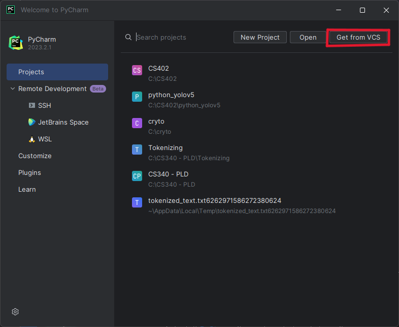
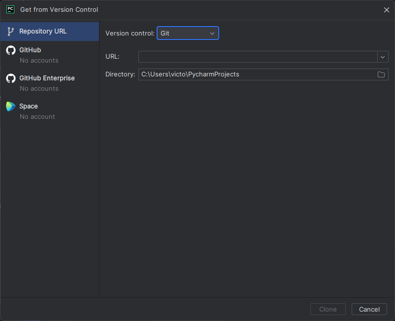

+++
title = "Ciclopes"
weight = 100
description = 'How to setup your environment to develop the Ciclopes'
+++

### Description
Ciclopes will be used to detect objects from videos/a camera to the mobile app. 
### Prerequisites
Microsoft Office 365 - This is needed for your program to work with excel files

Git

CUDA

### Development Enviroment
The SmartDot Simulator is currently being developed in JetBrains Rider. This tutorial will show you to set up Rider and begin developing the Simulator. JetBrains Rider is a cross-platform .NET IDE based on the IntelliJ platform and ReSharper. Let's get started!

First, let's install PyCharm.
1. Install [PyCharm](https://www.jetbrains.com/pycharm/) if you do not already have it

Next, let's configure it.

> **Ciclopes-YOLO**
>
> - Clone the Ciclopes-YOLO Repo repository `https://github.com/YCP-Rev-Metrix/Ciclopes-YOLO.git`

> **Ciclopes-OpenCV**
>
> - Clone the Ciclopes-OpenCV Repo repository `https://github.com/YCP-Rev-Metrix/Ciclopes-OpenCV.git`

> **Ciclopes-Mobile**
>
> - Clone the Ciclopes-Mobile Repo repository `https://github.com/YCP-Rev-Metrix/Ciclopes-Mobile.git`

4. Open the repository in PyCharm
4. run `pip install requirements.txt` in the terminal

Now, you are ready to start developing Ciclopes!! Have Fun, and be safe!

